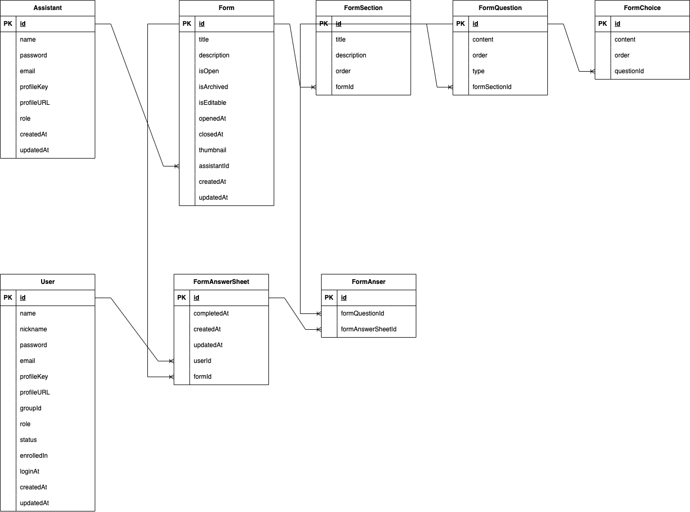

# 🖥️ Community Backend

커뮤니티 구축을 위한 템플릿 플랫폼 Backend

Frontend Repository: https://github.com/Hongik-Univ-DSC-Re-New/DSC-Frontend

---

## Technical Stack

---

### Development

- TypeScript
- Nest.js(v.10), Express.js
- Database
  - MySQL: MySQL 8.1
  - ORM: Prisma ORM
- Cache
  - Redis Cluster (1Master, 2Worker)
- System Metrics, APM Monitoring
  - Grafana (Docker on-premise)
  - Prometheus (Docker on-premise)
  - InfluxDB (Docker on-premise)
- Issue Tracking
  - Sentry (It can be change to custom exception tracker)

### Production

- AWS (Including future usage)
  - AWS EC2
  - AWS S3
  - AWS CodeCommit, CodeBuild, CodePipeline
  - AWS SQS, SNS
  - AWS Elastic Cache

## Rules

---

1. Use Interface Driven Development.

2. You need to make E2E test, Unit test.

- Test code require all of the error condition.

3. Need to migrate database after schema changed.

4. Use git-flow while development

5. Run E2E, Unit test before merge.

6. Present swagger as best effort.

7. Guarantee all of object in business logic to be **type-safe**

## Run API and API Document

1. Install dependencies

```

// yarn
yarn install

// npm
npm install
```

2. Initialize Prisma ORM Schema.

```
// yarn
yarn migrate

// npm
npm run migrate
```

3. Run Database & Redis Compose project

```
cd docker

docker compose up -d
```

4. Run API Application

```
yarn dev
```

5. Connect to Swagger Document from your browser

```
localhost:3000/docs
```

## Entitiy Relation Diagram (Will update always)



## Run test code

- E2E test

```
yarn test:e2e
```

- Unit test

```
yarn test:unit
```

## Contribution

---

Contribution are always welcome.

- Contact: jhoplin7259@gmail.com
